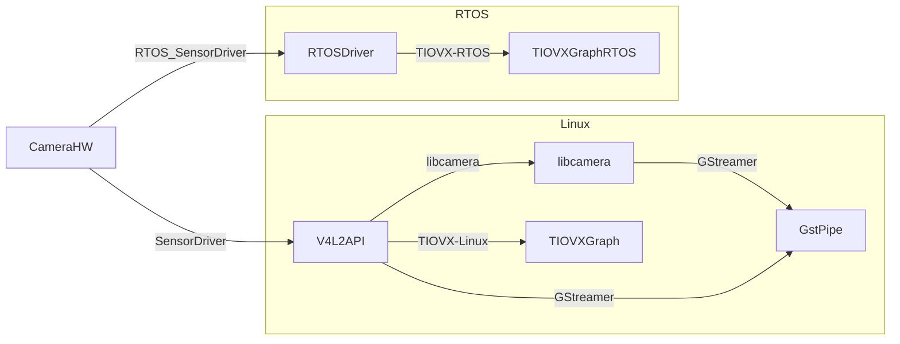

# Embedded Device Sensor Frameworks: State of the Art and Architecture

## Executive Summary

The modern embedded sensor stack features a layered architecture, with clear distinctions between sensor drivers/interfaces (V4L2, libcamera), processing frameworks (GStreamer, OpenMAX, TIOVX), and proprietary alternatives (MM Solutions). Choices depend on OS (Linux vs RTOS), required flexibility, performance needs, and available hardware platforms. This document synthesizes key frameworks, architectural layers, relationships, and usage scenarios for sensor pipelines in embedded vision systems—especially on TI platforms.

---
## 1. Overview of Frameworks and Layers

### 1.1 Kernel-Level Interfaces (Linux)
- **V4L2 (Video4Linux2):**
  - Kernel API/subsystem for video capture hardware.
  - Real sensor/camera drivers implement this interface—NOT a framework or userspace library.
- **Sensor Drivers:**  
  - Kernel modules (e.g., drivers/media/i2c/imx219.c) control actual sensors/ISP hardware and register with V4L2 subsystem.

### 1.2 Userspace Camera Abstractions (Linux)
- **libcamera:**
  - Modern, open-source userspace camera stack.
  - Bridges complex V4L2/Media Controller APIs to userspace (GStreamer, apps), hiding platform quirks.
  - Provides real-time adaptive Image Signal Processing (ISP) controls (AE/AWB/AF via IPA modules).
  - Exposes unified API for portable apps, contains platform-specific pipeline handlers.

### 1.3 Processing/Media Frameworks (Linux & RTOS)
- **GStreamer:**
  - Multimedia pipeline framework.
  - Connects sensor/capture sources (`v4l2src`, `libcamerasrc`) to multimedia/vision sinks through pluggable pipeline elements.
  - TI plugins (`tiovxisp`, etc.) provide access to hardware ISP and accelerators.
- **OpenMAX IL:**
  - Legacy component abstraction framework (codec, imaging blocks). 
  - Largely deprecated in modern vision/multimedia stacks.
- **TIOVX (OpenVX on TI):**
  - Graph-based computer vision framework prioritizing heterogeneous compute and real-time tasks.
  - In Linux, can be exposed through GStreamer plugins.
  - In RTOS, runs directly with vendor-specific drivers (e.g., `IssSensor_xxx` for TI devices).

### 1.4 Proprietary Camera & ISP Frameworks
- **MM Solutions (MMS) Guzzi:**
  - End-to-end proprietary camera framework.
  - Integrates hardware abstraction, ISP control, sophisticated 3A, and image quality tuning.
  - Often used in automotive/industrial platforms.

---
## 2. Data Flows: Linux vs RTOS Environments

### 2.1 Linux Path (With libcamera Example)
```
Camera HW → Sensor Kernel Driver (V4L2) → V4L2 API 
           ↘ libcamera (userspace abstraction) → libcamerasrc (GStreamer plugin) → GStreamer pipeline → App/
           ↘ TIOVX plugin (e.g., tiovxisp) → GStreamer pipeline → App
```

### 2.2 RTOS Path (No V4L2/No libcamera)
```
Camera HW → Vendor-Specific Sensor Driver (e.g., IssSensor_xxx)
           → TIOVX OpenVX graph (direct capture, ISP nodes) → RTOS application
```

---
## 3. Framework/Abstraction Comparison Table
| Aspect           | V4L2                        | libcamera                    | GStreamer                        | TIOVX (OpenVX)                          | MMS Guzzi     |
|------------------|-----------------------------|------------------------------|-----------------------------------|-----------------------------------------|--------------|
| **Layer**        | Kernel API                  | Userspace abstraction        | Media/processing framework        | Vision graph framework (user/kernel)    | Full stack    |
| **Role**         | Exposes sensors to userspace| Abstracts, controls, 3A IPA  | Builds pipelines, multi-domain    | Vision/ISP/acceleration pipelines       | Turnkey/proprietary|
| **OS support**   | Linux only                  | Linux only                   | Linux (*), RTOS (some plugins)    | Linux & RTOS                            | Linux & RTOS  |
| **ISP control**  | Yes (Hardware)              | Yes (HW & Software/3A)       | Plugin (pass-through or HW accel) | Nodes (VISS, capture, custom 3A)        | Yes           |
| **3A algorithms**| No                          | Yes (adaptive, open-source)  | Limited†                          | DCC-based, static (can be custom)       | Yes (sophisticated)|
| **Vendor scope** | Generic (platform support)  | Cross-platform               | Generic + vendor plugins          | Primarily TI (OpenVX = broader)         | Specific       |
| **Adaptive IQ**  | No                          | Yes                          | Plugin dependent                  | Pre-tuned DCC, or custom node           | Yes           |

†: GStreamer tiovxisp uses DCC-tuned parameters, not true adaptive algorithms.

---
## 4. ISP Processing: libcamera vs TIOVX Plugins

| Function                | libcamera             | TIOVX GStreamer Plugin           |
|-------------------------|----------------------|----------------------------------|
| Raw Bayer Processing    | Yes (via HW)         | Yes (via VPAC VISS)              |
| Adaptive 3A (AE/AWB/AF) | Yes (IPA modules)    | Limited (DCC files, AE presets)   |
| ISP Tuning              | YAML, runtime change | DCC binary/tuned offline          |
| Target Platforms        | Generic (cross-SoC)  | TI-specific HW only               |

- Use **libcamera** when you need cross-platform support, adaptive IQ, or open algorithm development.
- Use **TIOVX plugins/RTOS** when you need absolute performance or safety, or you must use DCC/automotive tuned IQ.

---
## 5. Clarified Terminology & Relationships

- **V4L2**: Kernel subsystem/API for exposing camera hardware to userspace on Linux.
- **libcamera**: Userspace cross-platform camera abstraction and control framework. Handles sensor management, ISP hardware setup, and real-time image quality algorithms.
- **GStreamer/TIOVX**: Pipelines and graph frameworks that consume sensor data, handle media/vision processing, and drive downstream applications.
- **MM Solutions**: Proprietary all-in-one stack, not public/open details, typically rivals libcamera + vendor-specific integration.

---
## 6. Recommended Usage Patterns
- **Linux (General purpose)**: Use V4L2 + libcamera abstraction, then connect to processing frameworks (GStreamer, TIOVX plugin) as needed.
- **Linux (TI Platform, highest perf)**: Use TI's TIOVX OpenVX stack, optionally with GStreamer plugins. For simple use, use V4L2, tiovxisp, and related TI hardware acceleration plugins.
- **RTOS**: Kernel APIs like V4L2/libcamera not present; use vendor-specific drivers (e.g., IssSensor_xxx) and build TIOVX OpenVX graphs directly.
- **Automotive/proprietary IQ needs**: Use MMS or similar frameworks if contractual/functional requirements exist.

---
## 7. Visual Layer/Flow Diagram



---
## 8. TI Locations for ISP Drivers

### Overview

The drivers for VPAC (Vision Processing Accelerator) and DMPAC (Depth and Motion Processing Accelerator) are in **different repositories** depending on the operating system environment. The PDK repository contains full-featured RTOS drivers, while Linux kernel drivers provide limited support with most production systems using a hybrid approach.

### RTOS Environment (PDK Repository)

**Repository**: `git://git.ti.com/processor-sdk/pdk.git`

**Primary Driver Location**:
```
pdk/packages/ti/drv/vhwa/
```

The **VHWA (Vision Hardware Accelerator)** driver provides comprehensive FVID2-based interfaces for all vision accelerator blocks:

| Component                | Hardware Block       | Location in PDK                      |
|--------------------------|----------------------|--------------------------------------|
| VISS (Vision ISP)        | VPAC ISP subsystem   | `ti/drv/vhwa/src/drv/vhwa_m2mViss.c` |
| MSC (Multi-Scaler)       | VPAC scaler          | `ti/drv/vhwa/src/drv/vhwa_m2mMsc.c`  |
| NF (Noise Filter)        | VPAC noise reduction | `ti/drv/vhwa/src/drv/vhwa_m2mNf.c`   |
| LDC (Lens Distortion)    | VPAC lens correction | `ti/drv/vhwa/src/drv/vhwa_m2mLdc.c`  |
| DOF (Dense Optical Flow) | DMPAC motion         | `ti/drv/vhwa/src/drv/vhwa_m2mDof.c`  |
| SDE (Stereo Disparity)   | DMPAC depth          | `ti/drv/vhwa/src/drv/vhwa_m2mSde.c`  |

**Related Drivers in PDK**:
```
pdk/packages/ti/drv/
├── vhwa/          # VPAC/DMPAC drivers
├── fvid2/         # Framework Video Device Driver 2 (base API)
├── csirx/         # CSI-2 receiver/capture interface
├── dss/           # Display SubSystem drivers
└── cal/           # Camera Adaptation Layer (AM6x)
```

**Driver Architecture**:
- **API Framework**: FVID2 (Framework Video Device Driver 2)
- **Target Cores**: R5F (MCU2_0, MCU2_1, MCU4_0), C7x DSP
- **OS Support**: Baremetal, FreeRTOS, SafeRTOS
- **Access Method**: Direct hardware register configuration via CSL (Chip Support Library)
- **Used By**: TIOVX kernels (`tivxVpacVissNode()`, `tivxVpacMscNode()`, etc.)

**Browsing Online**:
- Web interface: https://git.ti.com/cgit/processor-sdk/pdk/tree/packages/ti/drv/vhwa
- Documentation: `pdk/packages/ti/drv/vhwa/docs/doxygen/html/`
- Examples: `pdk/packages/ti/drv/vhwa/examples/`

### Linux Environment (Kernel Drivers)

**Repository**: Linux kernel mainline

**Driver Location**:
```
drivers/media/platform/ti-vpe/
```

**Available Components**:
- **VPE (Video Processing Engine)**: Mem-to-mem driver for older TI platforms (DRA7x, AM57xx)
- **CAL (Camera Adaptation Layer)**: CSI-2 receiver interface driver (AM6x, some J7 platforms)
- **VPDMA**: Video Port DMA engine

**Limitations for Jacinto 7/AM6xA**:
- Linux kernel drivers do **not** expose full VPAC/DMPAC functionality
- Native Linux drivers primarily support basic capture (CAL) and legacy VPE
- Full ISP features require RTOS drivers on R5F cores

**Kernel Source Locations**:
```
drivers/media/platform/ti-vpe/
├── cal.c              # Camera Adaptation Layer (CSI-2 capture)
├── vpe.c              # Video Processing Engine (legacy platforms)
├── vpdma.c            # Video Port DMA
└── csc.c              # Color Space Converter
```

### Hybrid Linux + RTOS Architecture (Production Systems)

Most production systems on Jacinto 7 (TDA4, J721E, J721S2, J784S4) and AM6xA use a **hybrid approach**:

```
┌─────────────────────────────────────────────────────┐
│ Linux Domain (A72 cores)                            │
│                                                      │
│  Application                                        │
│       ↓                                             │
│  TIOVX/Vision Apps (userspace)                     │
│       ↓                                             │
│  IPC/RemoteProc                                     │
└──────────────────┬──────────────────────────────────┘
                   │ (IPC Communication)
┌──────────────────┼──────────────────────────────────┐
│ RTOS Domain (R5F cores)                ↓            │
│                                                      │
│  TIOVX Kernels                                      │
│       ↓                                             │
│  VHWA Drivers (from PDK)                           │
│       ↓                                             │
│  CSL + Hardware Registers                          │
│       ↓                                             │
│  VPAC/DMPAC Hardware Blocks                        │
└─────────────────────────────────────────────────────┘
```

**Why This Architecture**:
1. **RTOS drivers** provide full hardware access and safety certification
2. **Linux applications** leverage existing ecosystem (GStreamer, OpenCV, ROS)
3. **RemoteProc framework** enables IPC between A72 Linux and R5F RTOS
4. **Resource partitioning** allows deterministic real-time on R5F with rich OS on A72

### Cloning and Building PDK Drivers

**Clone PDK Repository**:
```bash
git clone git://git.ti.com/processor-sdk/pdk.git
cd pdk
```

**Build VHWA Drivers** (example for J721E):
```bash
# Set environment
export PDK_INSTALL_PATH=$(pwd)
export BOARD=j721e_evm
export CORE=mcu2_0

# Build VHWA driver library
cd packages/ti/drv/vhwa
make all

# Build VHWA examples
cd examples/vhwa_viss_test
make all
```

**Integrated in Processor SDK RTOS**:
- Full PDK is included in Processor SDK RTOS releases
- Pre-built libraries available in SDK installation
- Typically used via TIOVX wrapper APIs rather than directly

### Safety Qualification

The **PDK VHWA drivers** include safety certification support:

| Aspect | Details |
|--------|---------|
| **Qualification** | ASIL B qualified versions available |
| **RTOS Support** | SafeRTOS on R5F cores |
| **Error Detection** | Hardware watchdog timers, line/block monitoring |
| **Documentation** | Safety manuals, FuSa (Functional Safety) app notes |
| **Scope** | VPAC VISS, MSC; DMPAC DOF, SDE modules |

**Safety documentation** available in:
- Processor SDK RTOS safety documentation package
- TI.com technical documents (application notes, user guides)

### Quick Reference: Where to Find What

| Need | Location | Repository |
|------|----------|------------|
| **Full VPAC/DMPAC drivers** | `packages/ti/drv/vhwa/` | git.ti.com/processor-sdk/pdk |
| **FVID2 framework** | `packages/ti/drv/fvid2/` | git.ti.com/processor-sdk/pdk |
| **CSI-2 capture driver** | `packages/ti/drv/csirx/` | git.ti.com/processor-sdk/pdk |
| **Linux CAL driver** | `drivers/media/platform/ti-vpe/cal.c` | Linux kernel mainline |
| **TIOVX kernels** | Multiple repos | git.ti.com/cgit/processor-sdk/ |
| **Vision Apps** | SDK installation | software-dl.ti.com |

**Documentation URLs**:
- VHWA API Reference: https://software-dl.ti.com/jacinto7/esd/processor-sdk-rtos-jacinto7/latest/exports/docs/pdk_jacinto_*/packages/ti/drv/vhwa/docs/
- Processor SDK RTOS: https://software-dl.ti.com/jacinto7/esd/processor-sdk-rtos-jacinto7/latest/
- Linux Kernel Docs: https://www.kernel.org/doc/html/latest/driver-api/media/

### Summary

- **RTOS/PDK**: Full-featured VPAC/DMPAC drivers in `git.ti.com/processor-sdk/pdk` under `packages/ti/drv/vhwa/`
- **Linux Kernel**: Limited drivers in `drivers/media/platform/ti-vpe/` (mostly legacy VPE and CAL capture)
- **Production Pattern**: Hybrid architecture with RTOS drivers on R5F accessed from Linux via RemoteProc/IPC
- **TIOVX Integration**: High-level TIOVX kernels wrap low-level VHWA/FVID2 drivers for application use

## 9. References
- libcamera.org/architecture
- TIOVX User Guide: https://software-dl.ti.com/jacinto7/esd/processor-sdk-rtos-jacinto7/latest/exports/docs/tiovx/docs/user_guide/index.html
- MM Solutions Guzzi: https://www.mm-sol.com/guzzi-camera-framework/

*This document synthesizes recent industry documentation (2024–2025) and actual code structure from TI, libcamera, and industry best practices for embedded sensor integration.*

